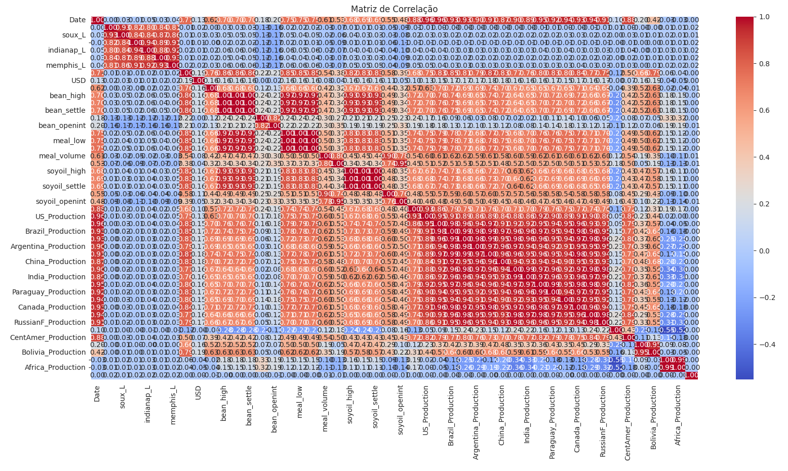
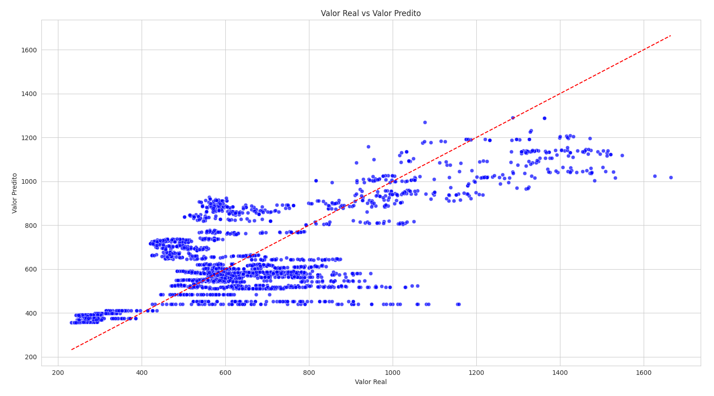
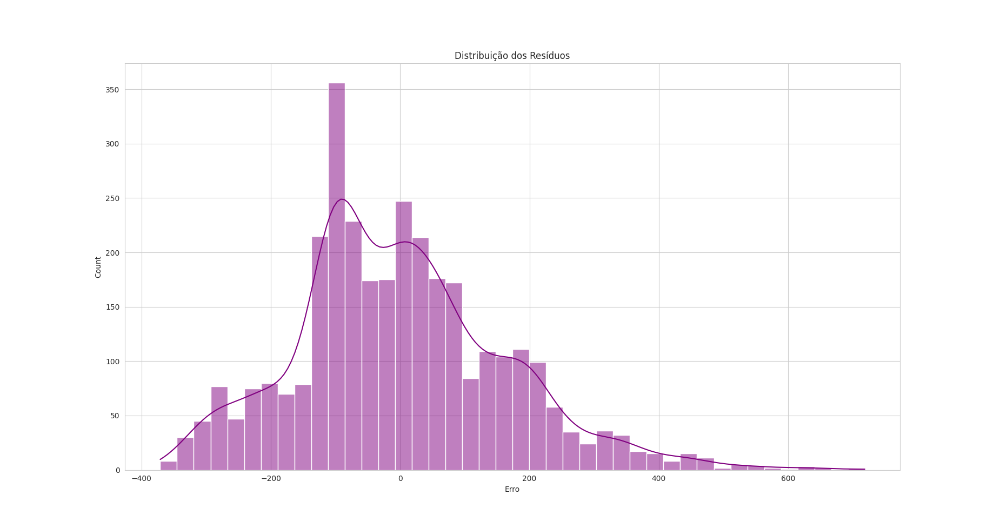

# Regressão Linear para Previsão do Preço da Soja

Este projeto realiza uma análise de regressão linear para modelar e prever o preço de fechamento da soja (`bean_settle`) com base em um conjunto de variáveis preditoras. O código utiliza bibliotecas Python como pandas para manipulação de dados, matplotlib e seaborn para visualização, scikit-learn para modelagem de regressão e métricas, e scipy.stats para análise estatística.

### dataset: [Soybean price factor data 1962-2018](https://www.kaggle.com/datasets/motorcity/soybean-price-factor-data-19622018)

## Visão Geral do Código

O script `ModelagemPrecoSoja.py` executa as seguintes etapas:

1.  **Importação de Bibliotecas:** Importa as bibliotecas necessárias para análise de dados, visualização e modelagem estatística.
2.  **Configurações:** Define o estilo dos gráficos, o tamanho padrão das figuras e a precisão de exibição dos DataFrames.
3.  **Carregamento dos Dados:** Carrega os dados de um arquivo Excel chamado `dataset.xlsx` para um DataFrame do pandas.

## Aplicação do KDD

1.  **Inspeção Inicial dos Dados:** Exibe informações gerais sobre o dataset (número de linhas, colunas, tipos de dados) e verifica a presença de valores nulos.
2.  **Limpeza e Pré-processamento dos Dados:**
    * Remove linhas duplicadas.
    * Remove linhas com valores nulos (embora a inspeção inicial tenha indicado que não havia).
    * Identifica e remove outliers utilizando o método do z-score (removendo pontos de dados que estão a mais de 3 desvios padrão da média de suas respectivas colunas numéricas).
3.  **Estatísticas Descritivas:** Exibe um resumo estatístico das principais medidas de tendência central, dispersão e forma das variáveis numéricas após a limpeza.
4.  **Matriz de Correlação:** Gera um mapa de calor da matriz de correlação para visualizar as relações lineares entre todas as variáveis numéricas. Isso ajuda a entender como as variáveis preditoras se relacionam com a variável alvo e entre si.
5.  **Histogramas:** Cria histogramas para cada variável numérica para visualizar suas distribuições de frequência.
6.  **Preparação dos Dados para o Modelo:**
    * Define a variável alvo (`bean_settle`) e as variáveis preditoras (`Oil`, `USD`, `US_Production`, `Brazil_Production`).
    * Padroniza as variáveis preditoras utilizando o `StandardScaler` para que tenham média zero e variância unitária.
    * Divide os dados padronizados em conjuntos de treinamento (80%) e teste (20%) para treinar o modelo e avaliar seu desempenho em dados não vistos. Um `random_state` é utilizado para garantir a reprodutibilidade da divisão.
7. **Treinamento e Avaliação do Modelo de Regressão Linear:**
    * Cria uma instância do modelo `LinearRegression`.
    * Treina o modelo usando os dados de treinamento.
    * Faz previsões sobre o conjunto de teste.
    * Calcula e exibe métricas de desempenho:
        * **Coeficientes:** Mostram o impacto de uma mudança de uma unidade (após a padronização) em cada variável preditora sobre a variável alvo, mantendo as outras constantes.
        * **Intercepto:** É o valor esperado da variável alvo quando todas as variáveis preditoras são zero (em seus valores médios originais, após a padronização).
        * **R² (Coeficiente de Determinação):** Indica a proporção da variância na variável alvo que é explicada pelo modelo. Varia de 0 a 1, com valores mais altos indicando um melhor ajuste.
        * **RMSE (Raiz do Erro Quadrático Médio):** Mede o erro médio das previsões do modelo na mesma unidade da variável alvo. Valores menores indicam melhor desempenho.
8. **Análise dos Resíduos:**
    * Calcula os resíduos (a diferença entre os valores reais e os valores preditos no conjunto de teste).
    * Gera um histograma da distribuição dos resíduos para verificar se eles estão aproximadamente normalmente distribuídos (uma suposição da regressão linear).
    * Cria um gráfico de dispersão dos valores reais versus os valores preditos. Idealmente, os pontos devem se alinhar próximos a uma linha de 45 graus.
    * Gera um gráfico de dispersão dos resíduos versus os valores reais para verificar se há algum padrão nos erros (homoscedasticidade).
    * Cria um QQ-plot dos resíduos para avaliar formalmente a normalidade da sua distribuição.

## Resultados

* **Variável Alvo:** `bean_settle`
* **Variáveis Preditoras:** `Oil`, `USD`, `US_Production`, `Brazil_Production`
* **Coeficientes:**
    * `Oil`: Aproximadamente 68.00
    * `USD`: Aproximadamente 7.74
    * `US_Production`: Aproximadamente 51.79
    * `Brazil_Production`: Aproximadamente 100.46
    * **Interpretação dos Coeficientes (após padronização):** Um aumento de um desvio padrão no preço do petróleo está associado a um aumento de aproximadamente 68 unidades no preço da soja, mantendo as outras variáveis constantes. Da mesma forma, os outros coeficientes indicam o impacto de um desvio padrão de suas respectivas variáveis preditoras no preço da soja. A produção de soja no Brasil (`Brazil_Production`) parece ter o maior impacto relativo no preço da soja, seguido pelo preço do petróleo (`Oil`) e pela produção nos EUA (`US_Production`). A taxa de câmbio (`USD`) apresenta o menor impacto relativo entre as variáveis consideradas.

* **R² (Coeficiente de Determinação):** Aproximadamente 0.6206
    * **Interpretação do R²:** Aproximadamente 62.06% da variabilidade no preço de fechamento da soja pode ser explicada pelo modelo de regressão linear utilizando as quatro variáveis preditoras selecionadas. Isso indica que o modelo tem um poder explicativo moderado para o preço da soja. Os 37.94% restantes da variabilidade podem ser influenciados por outras variáveis não incluídas no modelo ou por ruído dos dados.

* **RMSE (Raiz do Erro Quadrático Médio):** Aproximadamente 205.74
    * **Interpretação do RMSE:** Em média, as previsões do modelo para o preço da soja desviam do valor real em cerca de 205.74 unidades. Esta métrica fornece uma ideia da magnitude do erro de previsão do modelo.

## Conclusão

O modelo de regressão linear construído com as variáveis `Oil`, `USD`, `US_Production` e `Brazil_Production` explica aproximadamente 62.06% da variabilidade no preço de fechamento da soja. Embora o R² seja moderado, as variáveis preditoras incluídas fornecem informações relevantes para a previsão do preço da soja. O RMSE de aproximadamente 205.74 indica o erro médio das previsões.